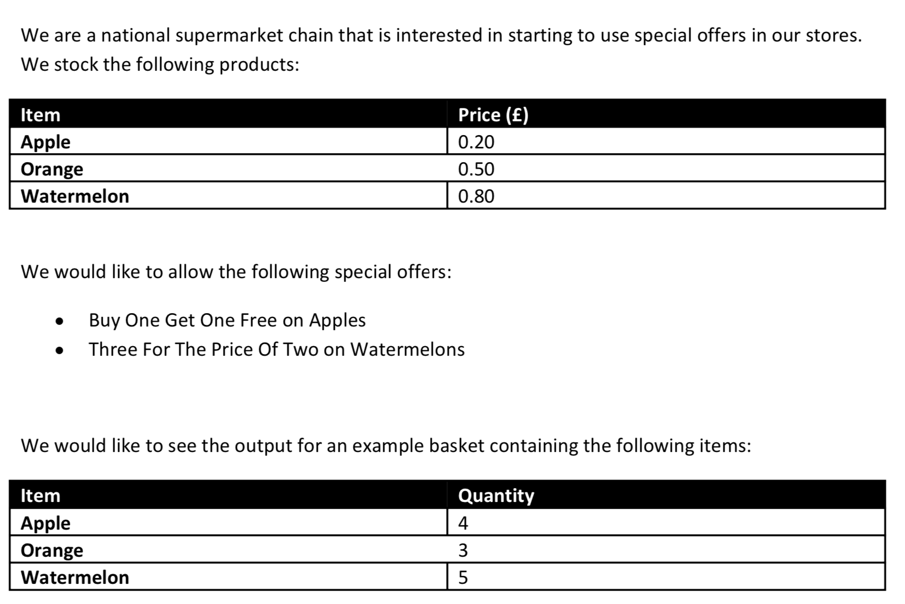

# kotlin-shopping-cart-sample
A shopping cart price calculator sample

## Requirements



## Example

```
Product  -----> Unit Price (£)
Apple --------> 0.20
Orange -------> 0.50
Watermelon ---> 0.80

***Current offers***
Buy One Get One Free on Apples
Three For The Price Of Two on Watermelons

How many apples do you want ? : 4
How many oranges do you want ? : 3
How many watermelons do you want ? : 5

Product ----> Price (£) -> Quantity -> Total 
Apple ------> 0.20  --------> 4 --------> 0.40
Orange -----> 0.50  --------> 3 --------> 1.50
Watermelon -> 0.80  --------> 5 --------> 3.20

Total ----------------------------------> 5.10
```